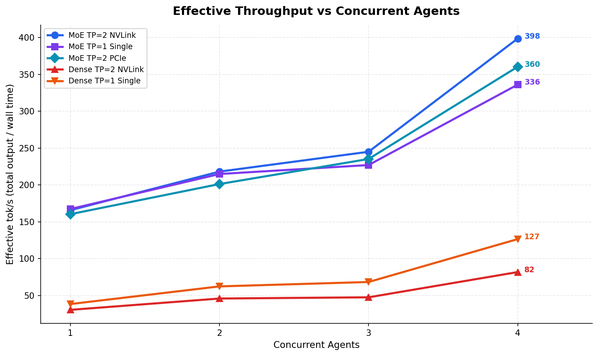
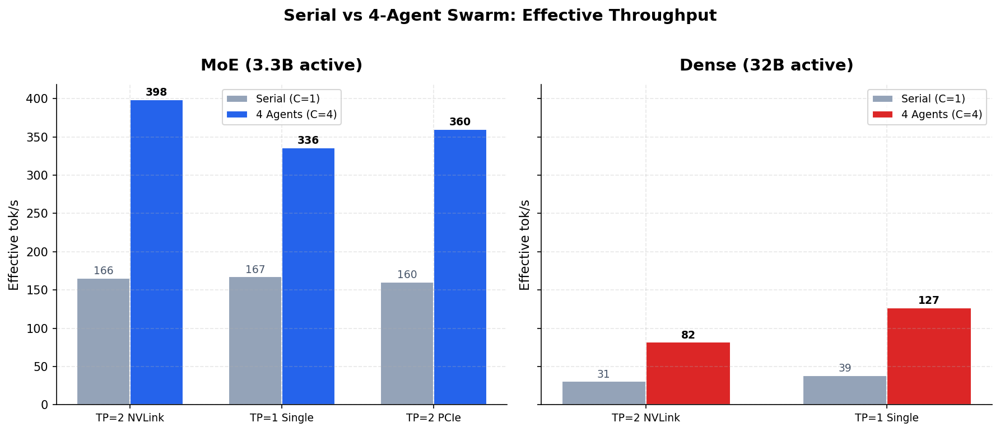
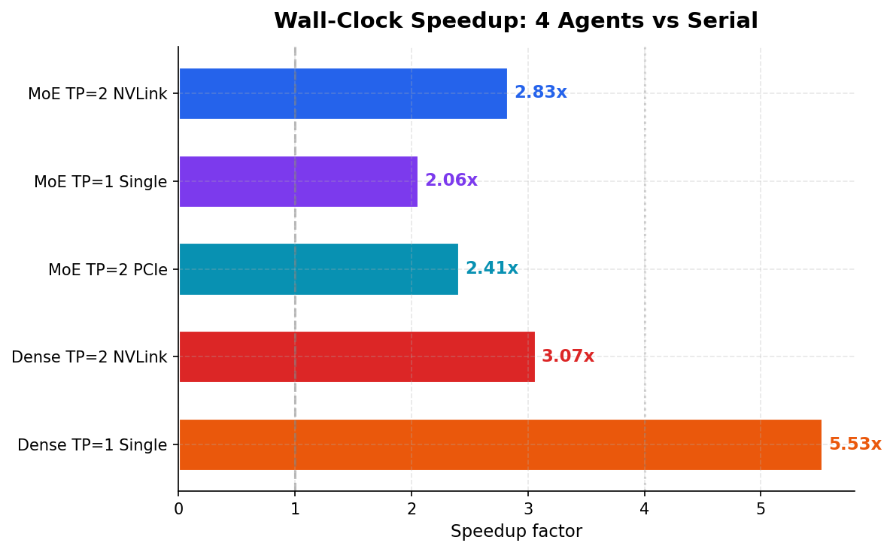
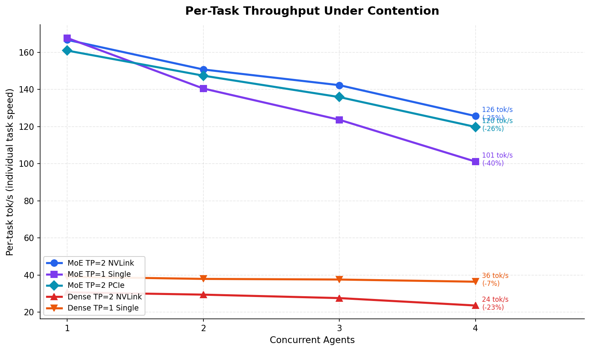
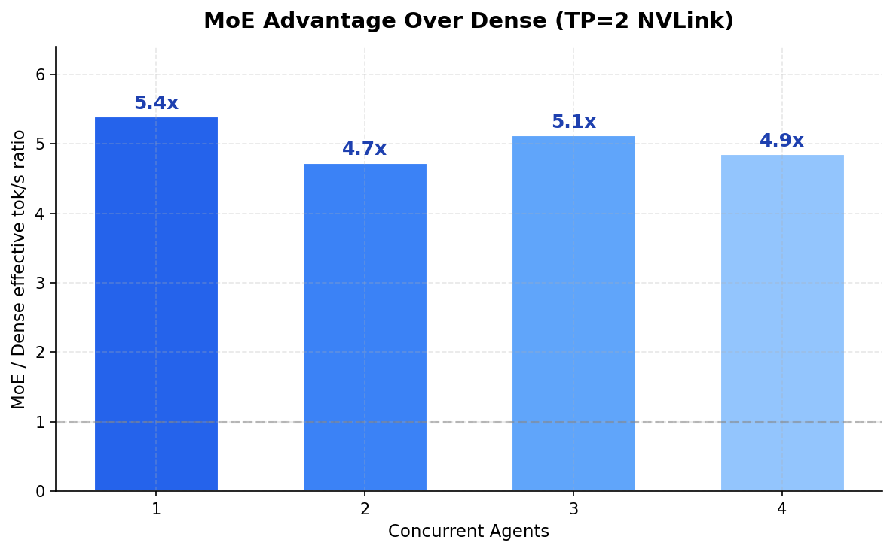

# MoE vs Dense for Coding Agent Swarms: Concurrency, Contention, and the Single-GPU Surprise

## The Thesis

A 2% inefficiency at the interconnect level becomes a 15% throughput loss at the application layer once you account for queuing, retries, and orchestration overhead. That compounding is how small architectural trade-offs produce enormous differences at scale. It's also how you reduce operational costs 40–60% while scaling — by measuring the right things and refusing to optimize what doesn't matter.

Most local LLM benchmarks measure single-request throughput: one prompt in, one response out, report the tok/s. That number tells you almost nothing about running a coding agent swarm — where an orchestrator dispatches 2, 3, or 4 tasks simultaneously to the same GPU. Under concurrency, memory bandwidth saturates, per-task throughput drops, and the architecture of the model determines whether you get useful parallelism or just contention.

We couldn't find anyone publishing sustained-load benchmarks for local LLM inference that isolate what actually matters for coding agent workloads: how model architecture and GPU topology affect throughput under concurrent load — serial and parallel, single-agent and swarm — on hardware where power delivery and thermal behavior are controlled variables, not noise.

So we ran the tests.

## TL;DR

| | Serial (1 agent) | Swarm (4 agents) | Speedup |
|---|---|---|---|
| **MoE** (TP=2 NVLink) | 166 tok/s | **399 eff. tok/s** | 2.83x |
| **MoE** (1x GPU) | 167 tok/s | **336 eff. tok/s** | 2.06x |
| **Dense** (TP=2 NVLink) | 31 tok/s | 82 eff. tok/s | 3.07x |
| **Dense** (1x GPU) | 39 tok/s | 127 eff. tok/s | 5.53x |

The MoE model delivers **399 effective tok/s** with 4 concurrent agents on two GPUs — completing a batch of 4 coding tasks in 26 seconds instead of 75. Even on a single $800 GPU, it sustains **336 eff. tok/s** under full swarm load. The dense model maxes out at 127 eff. tok/s in its best configuration.

**MoE is 4.9x faster than Dense under swarm load.** That ratio holds at every concurrency level.



## Architecture

```
┌────────────────────────────────────────────────────────────────┐
│  Dev Workstation                                                │
│                                                                  │
│  Claude Code (Opus) — Orchestrator                               │
│  Plans, decomposes tasks, reviews results                        │
│                                                                  │
│  ┌──────────┐  ┌──────────┐  ┌──────────┐  ┌──────────┐       │
│  │ Agent 1  │  │ Agent 2  │  │ Agent 3  │  │ Agent 4  │       │
│  │ code gen │  │ tests    │  │ refactor │  │ design   │       │
│  └────┬─────┘  └────┬─────┘  └────┬─────┘  └────┬─────┘       │
└───────┼──────────────┼──────────────┼──────────────┼────────────┘
        │              │              │              │
        └──────────────┴──────┬───────┴──────────────┘
                              │ LAN
                              ▼
        ┌──────────────────────────────────────────┐
        │  Inference Server                          │
        │  vLLM · OpenAI-compatible API · port 8000 │
        │  2x RTX 3090 NVLink · 48GB VRAM          │
        └──────────────────────────────────────────┘
```

This is a client-server architecture by design. The orchestrator (Claude Code on Opus) runs on the dev workstation and dispatches coding tasks over the internal network. The inference server runs vLLM with the local model. The LAN hop is part of the measurement — this is how you'd actually deploy it.

## What We Measured

### The Question

Single-request throughput tells you how fast one agent works. But a swarm cares about **effective throughput**: total tokens produced divided by wall-clock time. When 4 agents hit the same GPU simultaneously, each individual task slows down due to memory bandwidth contention. The question is: does the aggregate output justify the per-task penalty?

This depends on model architecture. A Mixture-of-Experts (MoE) model activates only 3.3B of its 30B parameters per token — it has bandwidth headroom even under contention. A dense model activates all 32B parameters on every token — it's already near the bandwidth ceiling at batch size 1.

### The Models

| | MoE | Dense |
|---|---|---|
| **Model** | [Qwen3-Coder-30B-A3B AWQ-4bit](https://huggingface.co/cyankiwi/Qwen3-Coder-30B-A3B-Instruct-AWQ-4bit) | [Qwen2.5-Coder-32B-Instruct AWQ](https://huggingface.co/Qwen/Qwen2.5-Coder-32B-Instruct-AWQ) |
| **Architecture** | Mixture-of-Experts | Dense transformer |
| **Total / Active params** | 30B / **3.3B** (8 of 128 experts) | 32B / **32B** (all weights) |
| **Quantization** | AWQ 4-bit, Marlin kernels | AWQ 4-bit, Marlin kernels |
| **Model size** | 16.9 GB | 19.5 GB |
| **Tool calling** | Native (`qwen3_coder`) | No |

Both use identical AWQ 4-bit quantization with Marlin kernels — hardware-accelerated on Ampere Tensor Cores. The only variable is architecture.

### GPU Configurations

| Config | GPUs | Interconnect | Context |
|--------|------|-------------|---------|
| **TP=2 NVLink** | Both GPUs, NVLink active | NV3 (~112 GB/s bidir) | 32–131K |
| **TP=1 Single** | One GPU only | N/A | 12–16K |
| **TP=2 PCIe** | Both GPUs, NVLink disabled | PCIe Gen 4 (~25 GB/s) | 32–131K |

Between each configuration change, the inference server is **rebooted** — not just the model restarted. This eliminates NVIDIA driver state corruption from model unloading as a confounding variable.

### The Prompts

16 unique coding prompts: 4 task types (algorithm implementation, test generation, architecture refactoring, system design) × 4 variants. Each concurrency level gets **completely different prompts** to defeat vLLM's prefix cache — every request forces a cold prefill.

All prompts target single-module scope (2,000–4,000 tokens output) with `max_tokens=8192`, ensuring responses complete naturally (`finish_reason: stop`) rather than being truncated. This is a deliberate methodology choice: capping output creates artificial uniformity that masks real-world variance. Letting responses complete naturally means the benchmark reflects actual agent workload patterns.

### Protocol

- **Warmup**: 1 round at C=4 with dedicated warmup prompts (not used in measurement)
- **Measurement**: 2 runs per concurrency level (C=1, C=2, C=3, C=4)
- **Metrics**: wall-clock time per run, completion tokens per task, per-task tok/s, effective tok/s (aggregate tokens / wall time)

## Results

### Effective Throughput: The Swarm Number

This is the metric that answers "should I run a swarm?" — total tokens produced per second of wall-clock time.

| Config | C=1 | C=2 | C=3 | C=4 |
|--------|-----|-----|-----|-----|
| **MoE TP=2 NVLink** | 166 | 218 | 245 | **399** |
| **MoE TP=1 Single** | 167 | 215 | 227 | **336** |
| **MoE TP=2 PCIe** | 160 | 201 | 235 | **360** |
| **Dense TP=2 NVLink** | 31 | 46 | 48 | **82** |
| **Dense TP=1 Single** | 39 | 63 | 69 | **127** |
| **Dense TP=2 PCIe** | — | — | — | **BROKEN** |

*Effective tok/s = total completion tokens across all concurrent tasks / wall-clock time. Higher is better.*

Dense TP=2 PCIe could not be tested — vLLM 0.17 nightly crashes with SIGBUS during weight loading when NVLink is disabled on this model. Both the CUDA graph path and the eager-mode fallback fail. This is itself a finding: **the dense model's software ecosystem is more fragile than MoE's**.



### Wall-Clock Speedup

The number a team lead cares about: how much faster does a batch of 4 coding tasks complete?

| Config | Serial Wall | Swarm Wall (C=4) | Speedup |
|--------|-------------|-------------------|---------|
| **MoE TP=2 NVLink** | 74.5s | 26.3s | **2.83x** |
| **MoE TP=1 Single** | 57.1s | 27.7s | **2.06x** |
| **MoE TP=2 PCIe** | 65.2s | 27.1s | **2.41x** |
| **Dense TP=2 NVLink** | 229.1s | 74.7s | **3.07x** |
| **Dense TP=1 Single** | 218.3s | 39.5s | **5.53x** |

*Wall time = longest-running task in the concurrent batch. Speedup = serial wall / swarm wall.*



The Dense TP=1 speedup (5.53x at C=4) looks suspiciously super-linear. This is partly an artifact: one serial run had a test-generation prompt that hit the 8192-token cap (221 seconds), inflating the C=1 baseline. The real speedup is closer to 3.1x using the clean run only.

### Contention: Where the Bandwidth Wall Hits

Contention measures how much each individual task slows down when sharing the GPU with other tasks. This is where architecture matters most.

| Config | C=1 per-task | C=4 per-task | Contention |
|--------|-------------|-------------|------------|
| **MoE TP=2 NVLink** | 167 tok/s | 126 tok/s | **25%** |
| **MoE TP=1 Single** | 168 tok/s | 101 tok/s | **40%** |
| **MoE TP=2 PCIe** | 161 tok/s | 120 tok/s | **26%** |
| **Dense TP=2 NVLink** | 31 tok/s | 24 tok/s | **23%** |
| **Dense TP=1 Single** | 39 tok/s | 37 tok/s | **7%** |

*Contention = (1 − C=4 per-task / C=1 per-task) × 100%. Lower is better.*



**The counterintuitive finding**: Dense shows *lower* contention than MoE. Dense TP=1 loses only 7% per-task throughput at C=4. But this is misleading — Dense starts so slow (39 tok/s) that there's no bandwidth to contend for. It's like saying a bicycle has less wind resistance than a car. The MoE model drops from 167 to 101 tok/s on a single GPU (40% contention), but 101 tok/s is still **2.7x faster** than Dense's best single-task speed.

### The MoE Advantage Under Load

The ratio holds — and it's even more dramatic than the single-request benchmarks suggested.



| Concurrency | MoE eff. tok/s | Dense eff. tok/s | MoE Advantage |
|-------------|----------------|------------------|---------------|
| 1 agent | 166 | 31 | **5.4x** |
| 2 agents | 218 | 46 | **4.7x** |
| 3 agents | 245 | 48 | **5.1x** |
| 4 agents | 399 | 82 | **4.9x** |

*Comparing best configurations: MoE TP=2 NVLink vs Dense TP=2 NVLink.*

At every concurrency level, MoE delivers **4.7–5.4x the effective throughput** of Dense. The advantage doesn't shrink under load — it holds steady because MoE's 3.3B active parameters leave enough memory bandwidth headroom to absorb the contention penalty without hitting a wall.

## Analysis

### 1. NVLink Now Matters — Under Contention

Our [previous single-request benchmarks](article-coding-benchmark.md) showed NVLink providing only a 4% boost for MoE. Under swarm load, the story changes:

| MoE Config | C=4 Effective tok/s | vs TP=1 |
|------------|---------------------|---------|
| TP=2 NVLink | 399 | **+19%** |
| TP=2 PCIe | 360 | **+7%** |
| TP=1 Single | 336 | baseline |

At C=4, NVLink provides a **19% effective throughput advantage** over single-GPU MoE. PCIe dual-GPU provides 7%. The all-reduce overhead that was invisible at batch size 1 compounds under concurrent load as GPUs synchronize more frequently.

**The decision**: NVLink isn't worth buying for single-agent workloads. But if you're running a swarm of 3–4 concurrent agents, the 19% boost at C=4 becomes meaningful — that's 399 vs 336 effective tok/s, or 26 seconds vs 28 seconds per 4-task batch.

### 2. Single GPU Is Still Remarkable

MoE on a single RTX 3090 delivers **336 effective tok/s** at C=4 — completing 4 coding tasks simultaneously. That's more than **4x the effective throughput** of Dense on two GPUs with NVLink (82 eff. tok/s).

The per-task contention on single GPU is higher (40% vs 25% on dual-GPU), which means each individual task takes longer. But the absolute numbers are what matter: 101 tok/s per task at C=4 is still fast enough for interactive agent loops. A 2,000-token function implementation completes in ~20 seconds per agent, with 4 agents working in parallel.

**The decision**: If budget is constrained, one RTX 3090 with the MoE model outperforms any Dense configuration by a wide margin. Add a second GPU for context length (>32K tokens) or to reduce per-task latency from 101 to 126 tok/s under swarm load.

### 3. Dense TP=2 PCIe Is Broken

The Dense model could not start on vLLM 0.17 nightly with `NCCL_P2P_DISABLE=1` (PCIe-only transport):

- **With CUDA graphs**: Engine core initialization crashes (SIGBUS during graph capture)
- **With `--enforce-eager`**: SIGBUS during weight loading when P2P is disabled
- **Both paths fail** — the model cannot run in TP=2 PCIe mode on this vLLM version

The MoE model runs all three configurations without issues. This highlights a practical difference: **MoE's smaller active parameter footprint is not just faster — it's more robust.** Fewer parameters in flight means less sensitivity to interconnect quirks, driver bugs, and CUDA graph capture edge cases.

### 4. Contention Is the Real Swarm Tax

The cost of running a swarm isn't the hardware — it's the per-task throughput penalty. Here's how to think about the trade-off:

| | Serial (4 tasks sequential) | Swarm (4 tasks concurrent) |
|---|---|---|
| **MoE TP=2 NVLink** | 4 × 75s = 75s total, 166 tok/s each | 26s total, 126 tok/s each |
| **Wall-clock savings** | | **49 seconds (65% faster)** |
| **Per-task cost** | | **25% slower per task** |

You trade 25% slower individual tasks for 65% faster batch completion. For agent workflows where the orchestrator dispatches independent tasks and waits for all to return, this is an unambiguous win. The only scenario where serial beats parallel is if you need maximum quality on a single task and per-token speed affects generation quality (it doesn't — temperature and sampling are independent of speed).

## The Test Platform

The test platform is a dedicated high-performance compute node — not a gaming desktop repurposed for inference. It replicates datacenter power and thermal topology at rack scale to produce measurements that reflect sustained capability under characterized conditions:

| Component | Spec | Why It Matters |
|-----------|------|----------------|
| CPU | AMD Threadripper, 32 cores / 3.7 GHz | 64 PCIe lanes — root complex feeds both GPUs at full Gen 4 x16 without contention |
| GPUs | 2x NVIDIA RTX 3090 24GB (Ampere, SM 8.6) | Consumer-available Ampere with highest VRAM density per dollar |
| Interconnect | NV3 NVLink (3 lanes, ~112 GB/s bidir) | Testable vs PCIe-only to isolate interconnect impact |
| Cooling | Rack-mounted custom liquid loop, waterblocked GPUs | Continuous duty cycle at rated TDP — no thermal throttling under sustained load |
| Power | 6 kW dry-type isolation transformer (wye, dedicated neutral) → 6 kW online double-conversion UPS | Datacenter-grade power chain: isolates GPU transients from mains, provides characterized voltage delivery |
| Storage | Samsung PM1735 enterprise NVMe (5.4TB ZFS) | Enterprise latency profile, power-loss protection |
| OS | Ubuntu 24.04, CUDA 12.8, driver 570.133.20 | Production stack |
| Inference | vLLM 0.17.0rc1.dev119 | Required for Qwen3 MoE support |

The power topology deserves explanation. GPU inference loads produce current transients during batch transitions that consumer power supplies absorb unpredictably. The dry-type isolation transformer converts incoming utility power to a clean, isolated supply; the online UPS performs continuous double-conversion (AC→DC→AC), eliminating voltage sag, ripple, and frequency drift. This is the same architecture used in datacenter PDU-to-rack power chains. Measurements taken on this platform reflect what the hardware delivers under controlled, repeatable conditions — not burst performance on a system whose power delivery is an uncontrolled variable.

## Critical vLLM Configuration

| Flag | Why |
|------|-----|
| `--disable-custom-all-reduce` | **Required** — custom all-reduce crashes on SM 8.6 during CUDA graph capture |
| `--enable-chunked-prefill` | Better memory efficiency for concurrent requests |
| `--max-num-seqs 4` | Match max concurrency level |
| `--gpu-memory-utilization 0.92` | Max safe value for TP=2 (0.95 for TP=1 Dense) |
| `--enforce-eager` | **Required for Dense model** — V1 engine CUDA graphs crash |
| `--dtype float16` | Required for AWQ/GPTQ models |
| `NCCL_P2P_DISABLE=1` | PCIe-only test: disables NVLink peer-to-peer |

**Note on FP8**: The RTX 3090 (SM 8.6) lacks native FP8 Tensor Core instructions. FP8 models work via software decompression but run 13% slower than AWQ 4-bit. Always use AWQ or GPTQ on consumer Ampere GPUs.

## Practical Recommendations

### If you have 1x RTX 3090 ($800)

Run MoE AWQ-4bit at TP=1. You get **167 tok/s serial, 336 eff. tok/s with 4 agents**. Context is limited to ~16K tokens — sufficient for most single-function coding tasks.

This is the best performance-per-dollar option. A single GPU running MoE under swarm load outperforms two GPUs running Dense by 4x.

### If you have 2x RTX 3090 ($1600)

Run MoE AWQ-4bit at TP=2 with NVLink if available. You get **166 tok/s serial, 399 eff. tok/s with 4 agents**, and 131K context for large codebases.

Without NVLink, you still get 360 eff. tok/s at C=4 — only 10% less. **NVLink is a 19% boost under swarm load**, a bigger deal than the 4% it provided at batch size 1. Whether that justifies the cost depends on your workload intensity.

### If you're considering Dense models

The Dense 32B model tops out at 82 eff. tok/s in its best configuration (TP=2 NVLink, C=4). That's less than **half** of what MoE delivers on a single GPU. Dense models still make sense for non-interactive workloads where quality per token outweighs speed — but for swarm-style parallel generation, MoE is the clear winner.

## What We'd Measure Next

- **C=6 and C=8**: Where does MoE contention hit diminishing returns? The bandwidth math suggests C=6 on dual GPU should still be productive.
- **Prefill-heavy workloads**: Long system prompts (8K+ tokens) stress the prefill pipeline differently than generation. NVLink may matter more here.
- **Qwen3.5 MoE**: The next-generation MoE models (35B-A3B) are currently broken in vLLM 0.17. When fixed, the architecture improvements may shift these numbers.
- **Quality under concurrency**: Does per-task code quality degrade when the model is under contention? (Hypothesis: no, since temperature/sampling is independent of throughput, but worth verifying.)

## Conclusion

The single-request benchmarks told us MoE was 2.6–4.1x faster than Dense. The swarm benchmarks tell a stronger story: **under concurrent agent load, MoE is 4.9x faster** — and the advantage is stable across concurrency levels.

For the emerging pattern of orchestrator + swarm development — where Claude, GPT-4, or a planning model dispatches parallel coding tasks to a local inference server — MoE models on consumer GPUs are not just adequate. They're the optimal architecture. A single RTX 3090 running Qwen3-Coder at 336 effective tok/s handles 4 concurrent agents faster than a Dense model on two GPUs with NVLink.

The hardware implications follow directly from the data:
- **One GPU is enough** for a productive swarm (336 eff. tok/s at C=4)
- **NVLink matters under load** (19% boost at C=4, vs 4% at C=1)
- **Dense models are bandwidth-starved** from the start — concurrency doesn't help
- **MoE's headroom is the story** — 3.3B active params means there's always bandwidth left to share

The bottom line: buy one RTX 3090, run the MoE model, dispatch 4 agents. You'll complete coding tasks faster than any Dense configuration at any price point on this hardware class.

---

*Benchmarked March 7, 2026. All benchmark code, scripts, and raw CSV results available at [github.com/sch0tten/local-llm-eval](https://github.com/sch0tten/local-llm-eval). Built with Claude Code.*

*Tags: GPU Cluster Operations, AI Agent Infrastructure, Inference Optimization, Fleet Management*
