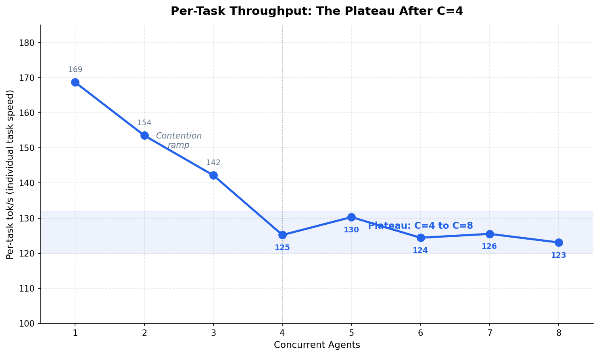
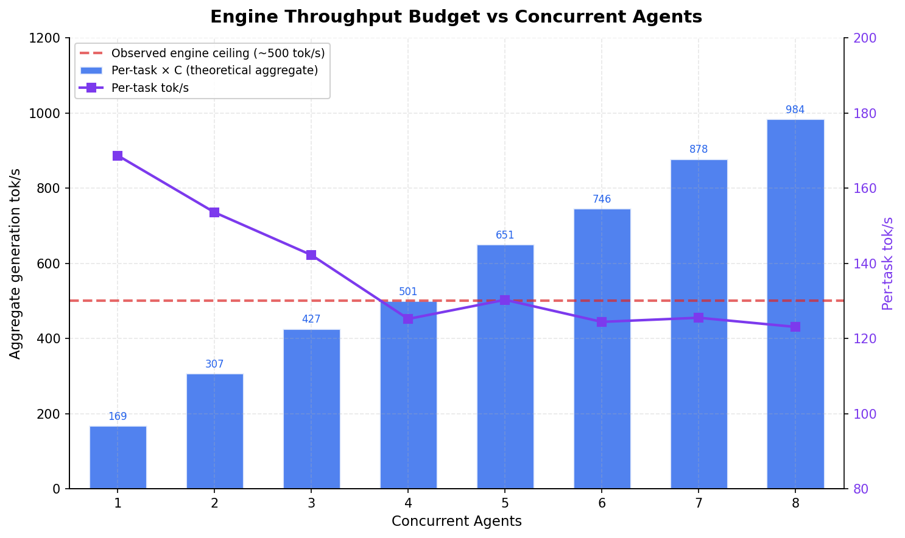
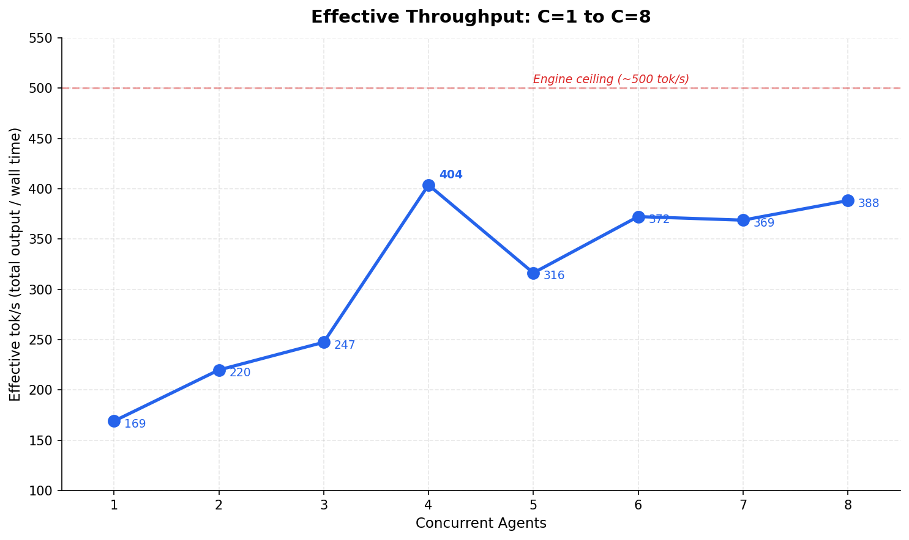
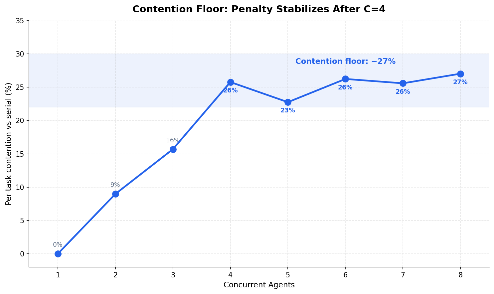

# Local LLM Bench: Scaling Coding Agent Swarms to 8 Concurrent Agents

*This is Part 3 of the Local LLM Bench series. [Part 1](/articles/best-local-llm-agentic-coding/) covers the single-request baseline. [Part 2](/articles/best-local-llm-coding-agent-swarm/) established the MoE advantage under concurrent load up to 4 agents.*

## The Finding

Part 2 concluded that 4 concurrent agents was the sweet spot — 399 effective tok/s on two RTX 3090s with NVLink. We assumed adding more agents would increase contention and produce diminishing returns.

We were wrong about the mechanism. After scaling to 8 concurrent agents and correlating vLLM engine logs with benchmark results, the data tells a different story:

**Per-task throughput plateaus at C=4 and stays flat through C=8.** Agents 5 through 8 are free.

| Concurrent Agents | Per-task tok/s | Effective tok/s | Marginal cost |
|:------------------:|:--------------:|:---------------:|:-------------:|
| 1 | 169 | 169 | — |
| 2 | 154 | 220 | -9% per task |
| 3 | 137 | 247 | -11% per task |
| 4 | 125 | 404 | -9% per task |
| 5 | 130 | 316 | +4% per task |
| 6 | 124 | 372 | -5% per task |
| 7 | 126 | 369 | +2% per task |
| 8 | 123 | 388 | -2% per task |

Read the C=4 to C=8 column. Per-task throughput oscillates between 123 and 130 tok/s — that's noise, not degradation. The contention penalty that matters (169 → 125 tok/s, about 27%) happens between C=1 and C=4. After that, the floor is reached.



## What "Contention" Actually Is

In Part 2, we attributed the 27% per-task throughput drop to memory bandwidth contention — more concurrent sequences competing for the same GDDR6X bandwidth. That's part of the story. The vLLM engine logs reveal another factor.

### Prefix Cache and the C=1 Baseline

vLLM's automatic prefix caching reuses KV cache blocks when a new request shares a prefix with a recent one. Our benchmark uses different prompt variants per concurrency level to defeat this — each level gets completely different prompts. But within each level, the two measurement runs use the **same** prompts.

The engine logs during our benchmark:

| Phase | Prefix Cache Hit Rate | What's Happening |
|-------|:---------------------:|-------------------|
| Warmup | 0% | Cold start, all prompts new |
| C=1 Run 1 | 0% | Variant A, first time — fully cold |
| C=1 Run 2 | 11% → 54% | Same variant A prompts — cache warming |
| C=2 | 55% → 60% | New variant B, but some blocks reusable |
| C=3 | 61% → 66% | Cache accumulating across variants |
| C=4 | 65% → 70% | Cumulative cache benefit |
| C=5–8 | 60% → 67% | Plateau — cache eviction balances accumulation |

The C=1 baseline averages Run 1 (0% cache) and Run 2 (up to 54% cache). That averaged 169 tok/s baseline is **boosted by prefix cache on the second run**. When we compare it to C=4+ where every request runs against a warmer cache in a different way, part of what looks like "contention" is actually a measurement artifact from cache dynamics.

This doesn't invalidate the numbers — in production, prefix cache is always active and your agent prompts will share common system prompts, tool definitions, and partial context. The point is that the 27% "contention penalty" is an upper bound. The real compute contention is lower.

### The 500 tok/s Engine Ceiling

The other half of the story is in the aggregate generation throughput reported by vLLM:

```
Running: 4 reqs → Avg generation throughput: 498.4 tokens/s
Running: 4 reqs → Avg generation throughput: 500.3 tokens/s
Running: 4 reqs → Avg generation throughput: 496.0 tokens/s
```

The engine hits a ~500 tok/s aggregate ceiling regardless of whether 4 or 8 requests are active. This is the actual compute saturation point — the GPU pair has a fixed token generation budget. At C=4, each task gets ~125 tok/s (500/4). At C=8, each task gets ~123 tok/s — not 500/8 = 62.5, because vLLM's continuous batching scheduler doesn't divide bandwidth equally. Shorter tasks finish and yield their slots, keeping per-task throughput higher than the naive division would suggest.



## The Scaling Curve

Here's the full picture from C=1 to C=8:



### Effective throughput peaks at C=4, then plateaus

| Concurrent Agents | Eff. tok/s | Wall Time (avg) | Speedup vs Serial |
|:------------------:|:----------:|:---------------:|:-----------------:|
| 1 | 169 | 55.0s | 1.00x |
| 2 | 220 | 39.9s | 1.38x |
| 3 | 247 | 38.3s | 1.44x |
| 4 | 404 | 24.4s | 2.26x |
| 5 | 316 | 32.7s | 1.68x |
| 6 | 372 | 34.8s | 1.58x |
| 7 | 369 | 29.8s | 1.85x |
| 8 | 388 | 33.0s | 1.67x |

The effective throughput numbers above C=4 look noisy — 316 at C=5, 372 at C=6, 388 at C=8. This variance comes from **prompt output length**, not throughput degradation. Different variant sets produce different total tokens (variant E averages 10,357 tokens, variant H averages 12,759). Since effective tok/s = total tokens / wall time, output length variation masks the underlying throughput stability.

The per-task tok/s tells the real story: **flat from C=4 to C=8**.

### Why this matters for agent architectures

The practical implication: `--max-num-seqs 8` costs nothing. You're not choosing between 4 fast agents and 8 slow ones. You're choosing between 4 agents at 125 tok/s and 8 agents at 123 tok/s.

For an orchestrator dispatching independent coding tasks — generate a module, write its tests, refactor a dependency, draft documentation — doubling the parallelism from 4 to 8 means completing 8 tasks in the time it previously took to complete 4, with each task barely slower.

## What Changed Since Part 2

### Methodology updates

We expanded from 16 to 32 unique prompts (4 task types × 8 variants) to support C=1 through C=8. Same constraint: every concurrency level gets completely different prompts to prevent prefix cache from inflating throughput within a batch.

All 32 prompts completed naturally (`finish_reason: stop`) — no truncation at `max_tokens=8192`. The prompts target single-module scope: algorithm implementations, test suites, architecture refactoring, system design. This matches the output profile of real coding agent subagents.

### Server configuration

The model runs as deployed — no reconfiguration between test levels:

| Parameter | Value |
|-----------|-------|
| **Model** | Qwen3-Coder-30B-A3B AWQ-4bit (3.3B active params) |
| **Quantization** | AWQ 4-bit, Marlin kernels |
| **Tensor parallel** | TP=2, NVLink |
| **Max sequences** | 8 |
| **Context** | 32K tokens |
| **GPU memory** | 92% utilization |
| **Chunked prefill** | Enabled |

```
vllm serve cyankiwi/Qwen3-Coder-30B-A3B-Instruct-AWQ-4bit \
    --tensor-parallel-size 2 \
    --enable-chunked-prefill \
    --max-num-seqs 8 \
    --disable-custom-all-reduce \
    --gpu-memory-utilization 0.92 \
    --max-model-len 32768 \
    --tool-call-parser qwen3_coder
```

## The Contention Floor

Part 2 called the 27% per-task degradation at C=4 a "contention wall." The extended data shows it's better described as a **contention floor** — a stable operating point where the GPU compute is saturated but not overloaded.



| Concurrency | Per-task tok/s | Contention vs C=1 |
|:-----------:|:--------------:|:------------------:|
| 1 | 169 | 0% |
| 2 | 154 | 9% |
| 3 | 137 | 19% |
| 4 | 125 | 26% |
| 5 | 130 | 23% |
| 6 | 124 | 27% |
| 7 | 126 | 26% |
| 8 | 123 | 27% |

The contention curve has two distinct regions:

1. **C=1 to C=4**: Linear degradation as concurrent sequences compete for GDDR6X bandwidth (936 GB/s per GPU). Each additional agent costs ~9% per-task throughput.
2. **C=4 to C=8**: Plateau. Per-task throughput stabilizes at 123–130 tok/s. Additional agents are effectively free.

The transition at C=4 aligns with the ~500 tok/s engine ceiling. Once the GPU pair is saturated, vLLM's continuous batching scheduler manages the queue efficiently enough that adding more sequences doesn't increase per-token latency — it just increases total tokens in flight.

### Per-task breakdown by type

The plateau holds across all four task types, not just in aggregate:

| Task Type | C=1 | C=4 | C=8 | C=4→C=8 delta |
|-----------|:---:|:---:|:---:|:-------------:|
| Algorithm | 170 | 127 | 125 | -2 tok/s |
| Testing | 170 | 123 | 122 | -1 tok/s |
| Refactoring | 166 | 124 | 123 | -1 tok/s |
| System Design | 169 | 127 | 122 | -5 tok/s |

No task type is disproportionately affected by higher concurrency. The MoE architecture distributes the compute budget evenly regardless of workload mix.

## Practical Recommendations

### Our lab configuration

These results come from our specific setup: **2x RTX 3090 over NV3 NVLink** running TP=2 with `--max-num-seqs 8`. This is where we found our sweet spot — the C=4 plateau, the ~500 tok/s engine ceiling, the 27% contention floor. All the numbers in this article reflect this dual-GPU NVLink configuration.

**A single RTX 3090 will produce different numbers.** Part 1 showed that MoE on a single GPU runs at 98% of NVLink speed for serial workloads (167 vs 166 tok/s). Under swarm load, the gap widens — Part 2 measured 336 eff. tok/s at C=4 on single GPU vs 399 on NVLink (16% less). The contention plateau will likely hit at a different concurrency level on a single GPU, and the engine ceiling will be lower. But the principle holds: there will be a concurrency level where per-task throughput stabilizes, and agents beyond that point come for free.

The architectural behavior — contention ramp followed by stable plateau — is a property of MoE inference on saturated GDDR6X, not of our specific GPU count. What changes across configurations is where the transitions occur.

### Updated from Part 2

**Set `--max-num-seqs 8`** instead of 4. On our dual-GPU setup, there is no per-task penalty beyond C=4. The only cost is slightly more KV cache memory, which at 0.92 GPU utilization on 48GB total is not a constraint — our benchmark showed peak KV cache usage of 4% even at C=8.

**Don't limit your agent swarm to 4.** If your orchestrator can decompose work into 6 or 8 independent tasks, dispatch them all. Each agent gets 123 tok/s — a 2,000-token function implementation completes in 16 seconds. Eight of them complete in 16 seconds total, not 130 seconds serial.

**Prefix cache is your friend in production.** Our benchmark deliberately defeats prefix caching for measurement purity. In a real agent deployment, all subagents share a system prompt, tool definitions, and often partial context. Prefix cache hit rates of 50–70% are realistic, which means your actual per-task throughput under load will be **higher** than what we measured.

### The swarm capacity table (2x RTX 3090 NVLink)

| Agents | Per-task tok/s | Time for 2K tokens | Aggregate tok/s | Agents per minute (2K tok each) |
|:------:|:--------------:|:-------------------:|:---------------:|:-------------------------------:|
| 1 | 169 | 11.8s | 169 | 5.1 |
| 4 | 125 | 16.0s | 500 | 15.0 |
| 8 | 123 | 16.3s | 984 | 29.5 |

At 8 concurrent agents, the system completes nearly **30 coding tasks per minute** — each producing a full module, test suite, or refactored component. The per-task latency increase from serial (11.8s) to 8-agent swarm (16.3s) is 4.5 seconds. That's the total cost of 8x parallelism.

## What Comes Next

- **Code quality evaluation under concurrency**: All three parts of this series measure throughput — tokens per second, wall-clock time, contention. We haven't yet measured whether the *quality* of generated code degrades under concurrent load. Temperature and sampling are independent of throughput, so the hypothesis is no — but verifying this with automated code quality metrics (test pass rates, static analysis, functional correctness) is the next priority.
- **Context length under concurrency**: How does per-task throughput change when agents use 8K or 16K context windows instead of the ~200-token prompts in this benchmark? Longer contexts consume more KV cache, which may shift the C=4 plateau to a lower concurrency level.
- **Heterogeneous workloads**: Real agent swarms mix short tasks (code review, small edits) with long tasks (full module generation). Does the plateau hold when task lengths vary by 10x?
- **Production system prompt overhead**: Measuring actual prefix cache benefit with a shared 2K-token system prompt across all agents, matching a real Claude Code → local model deployment.
- **Single GPU scaling curve**: Repeating the C=1 through C=8 sweep on a single RTX 3090 to map where the contention plateau lands without NVLink, and whether `--max-num-seqs 8` remains free on 24GB.

## The Test Platform — And Why These Are Floor Numbers

| Component | Spec |
|-----------|------|
| CPU | AMD Threadripper, 32 cores / 3.7 GHz, 64 PCIe lanes |
| GPUs | 2x NVIDIA RTX 3090 24GB (Ampere, SM 8.6), NV3 NVLink |
| Memory | GDDR6X, 936 GB/s per GPU (1.87 TB/s aggregate) |
| Cooling | Rack-mounted custom liquid loop, waterblocked GPUs |
| Power | 6 kW isolation transformer → 6 kW online double-conversion UPS |
| Storage | Samsung PM1735 enterprise NVMe, 5.4TB ZFS |
| OS | Ubuntu 24.04, CUDA 12.8, driver 570.133.20 |
| Inference | vLLM 0.17.0rc1.dev119 |

### These results are the baseline, not the ceiling

The RTX 3090 is a 2020 GPU. It uses GDDR6X — fast for its generation, but the bottom of the stack for inference workloads in 2026. Every limitation we hit in this benchmark is a memory subsystem constraint that newer hardware directly addresses.

The ~500 tok/s engine ceiling is a GDDR6X bandwidth wall. The 27% contention floor is what happens when concurrent sequences compete for 936 GB/s per GPU with a 6 MB L2 cache. Both of these constraints loosen dramatically as you move up the hardware stack:

| GPU | Memory | Bandwidth | L2 Cache | What changes |
|-----|--------|-----------|----------|-------------|
| **RTX 3090** (this bench) | 24GB GDDR6X | 936 GB/s | 6 MB | Baseline — 500 tok/s ceiling |
| **RTX 4090** | 24GB GDDR6X | 1,008 GB/s | 72 MB | 12x L2 cache: KV cache blocks stay on-chip, contention floor drops. Modest bandwidth gain. |
| **RTX 5090** | 32GB GDDR7 | 1,792 GB/s | 128 MB | 1.9x bandwidth + 21x L2 cache: engine ceiling shifts to ~900+ tok/s, contention floor likely halves. |
| **A100** | 80GB HBM2e | 2,039 GB/s | 40 MB | 2.2x bandwidth, 80GB VRAM: larger models, longer contexts, higher max-num-seqs. |
| **H100** | 80GB HBM3 | 3,350 GB/s | 50 MB | 3.6x bandwidth + native FP8: engine ceiling well above 1,500 tok/s. Different regime entirely. |

The L2 cache difference is particularly relevant for MoE inference. When the active expert weights (3.3B params at 4-bit = ~1.7 GB) partially fit in L2, the memory bandwidth pressure drops because repeated expert activations hit cache instead of DRAM. The RTX 3090's 6 MB L2 caches virtually nothing — every expert fetch goes to GDDR6X. An RTX 5090 with 128 MB L2 would cache significant portions of the hot expert set, reducing effective memory traffic per token.

**The scaling patterns we measured — the contention ramp, the plateau, the prefix cache dynamics — are architectural behaviors that hold across hardware.** What changes is where the transitions occur. The C=4 plateau on GDDR6X might become C=8 or C=12 on HBM. The 27% contention floor might drop to 10-15% with 20x more L2 cache. The 500 tok/s engine ceiling is a GDDR6X number, not a model architecture limit.

That's the point: if an MoE model on 2020 consumer GPUs delivers 8 concurrent agents at 123 tok/s each, the same architecture on current hardware isn't incrementally better — it's a different class of performance.

---

*Benchmarked March 9, 2026. All benchmark code, scripts, and raw CSV results available at [github.com/sch0tten/local-llm-eval](https://github.com/sch0tten/local-llm-eval). Built with Claude Code.*

*Tags: GPU Cluster Operations, AI Agent Infrastructure, Inference Optimization, Fleet Management*
